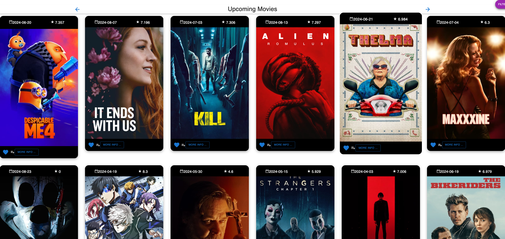

# Full stack 2 Assignment

## Features
#### UI-

* Favorites Page
* Watchlist Page
* Upcoming movies Page
* Most Popular movies Page(parameterised URL)
    1. Detail view-Movie details
    2. Similar movies
* Most Popular Actors Page(parameterised URL)
    1. Detail view-Actor Bio
* Pagination on Home Page

####  Data Model-
- An additional data entity type, e.g. Actor, 
- Data caching
    1. Cast listed in movie details page

####  Functionality-
* Additional movie filters
    1. Released after/before

## Features Design

### Favorites Page
> List of favorite of movies tagged from TMDB

### Watchlist Page

### Upcoming movies Page

### Most Popular movies
>1. Detail view-Movie details
> 2. Similar movies

### Most Popular Actors Page
>1. Detail view-Actor Bio
Biography and details of popular actors

###  Pagination on Home Page

### Data caching
> Cast listed in movie details page

### Additional movie filters
> Released after/before

